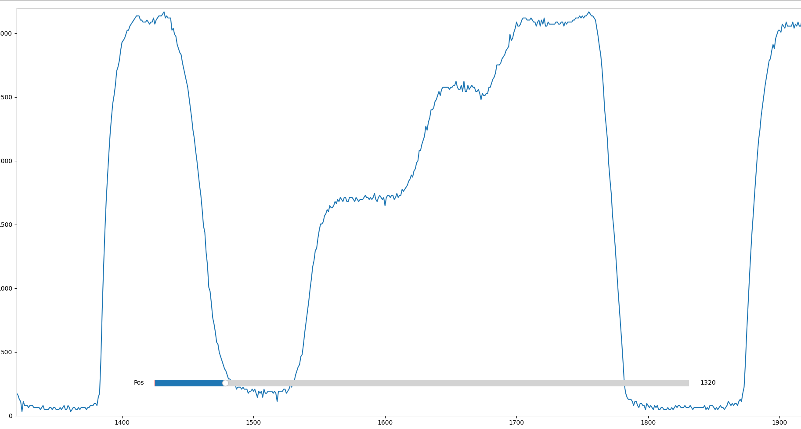

# Log 2

I'll put everything that's happened since the last log in 3 categories - Xcode generation; data generation/recording; decoding algorithm

## X-Code Generation

The general approach I used was to generate a sequence of rectangles(svg), each with a shade of grey randomly (for the most part) chosen from a palette. I settled on a pallete of 5 shades (including w-white and b-black) for testing. We could probably increase the number of shades later on.

A sample code looks something like this: 

<!--  -->

\**I'll use "letter" to represent the shades in a palette here on out*  
\**I'll use w-white and b-black to represent the lightest shade and darkest shade in the palette respectively*

### Constraints on X-Code Generation 

1. The first and last letter are always w-white -- so it's possible to tell where one x-code starts and ends.
2. The second letter is always b-black -- I thought this might be a good idea for the sake of adaptive decoding but we might be able to do without it. 
3. The same letter cannot appear in consecutive places -- I think this makes decoding easier for pen-type scanners since it makes it easy to tell where one letter ends and another begins. The downside of this constraint is that it reduces the number of possible x-codes.
4. As long as the first 3 constraints are satisfied, there is no constraint on how many letters may be in an x-code.

This is the [script](../bnw/data/gen_codes.py) I used for generating X-codes and here's a [sample]((../bnw/data/samples_v2_4.svg)) page of randomly generated X-codes  

<!--  -->

*The script is quite crude. There's some copy-pasting that happens between the script output and the final page*

## Data Generation/Recording
I got an Esp32 dev board (like I mentioned in the last log). To generate data, I
1. Connected the circuit (from the last log) output to one of the Esp32's ADC channels
2. Flashed the Esp32 with a small script to log the ADC readings over the serial port. I used the Arduino studio to accomplish this.
3. Generated scans by moving the tip of the scanner across X-codes.
4. Wrote a small [Python script](../bnw/data/read_data.py) to receive the data from the Esp32 and write it to a [file](../bnw/data/sample_reads/sample_reads3.txt).

Plotted with Matplotlib, the collected data looks something like this:

<!--  -->

## Decoding

The Esp32's ADC generates readings in the range (0, 4095), corresponding to voltage measurements in the (0V, 3.3V) range. It's response to input voltages is mostly liinear. 

The decoding approach I explored exploits a property that can be observed in the graph above. The areas where the x-codes occur are like inflection points on a graph -- the gradient is ~0. Crucially, as the scanner moves across an x-code, it naturally spends more time on a letter (areas with low gradient on the graph) than it spends in the space between letters (very high gradient).

First step was to categorize the readings into "bands", e.g

(0,300) - code1 (w-white)
(301,699) - inter-code space
(700, 1000) - code 2 (shade of grey)
(1000, 1500) - inter-code space
...
...
(3800, 4096) - b-black

*The bands are determined by observing the ADC readings for each letter*

Following this, decoding proceeds roughly as follows:

1. T consecutive readings (where T is some threshold value) of w-white is interpreted as the beginning of an x-code
2. If readings stay within a data band for T consecutive samples, a letter is deemed to have been detected
3. T consecutive readings of w-white is interpreted as the end of an x-code

## Onward/To-do
1. Port the decoding algorithm to C
2. Bluetooth connection (*insert crying emoji*)
3. Figure out a way to make readings consistent
4. Figure out a means to adapt to print surfaces/materials that have reflectances that are different from the test-prints
5. Revisit how x-codes are defined/generated to possibly improve the number of possible x-codes and decide on how/if mirroring should be supported (what happens if an x-code is read from right to left?)

*Pls 4give typo*