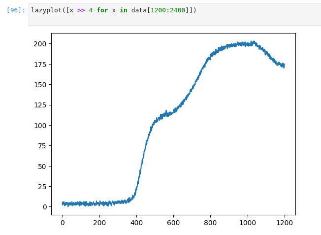
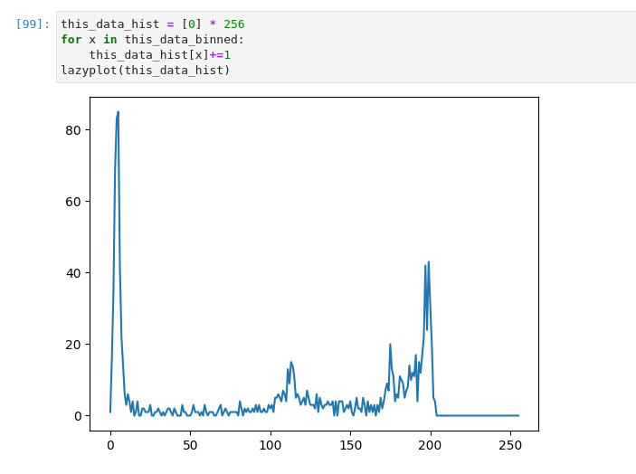
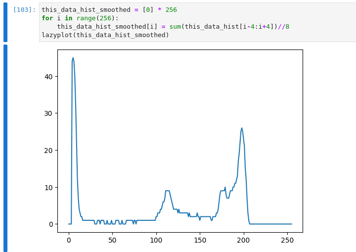
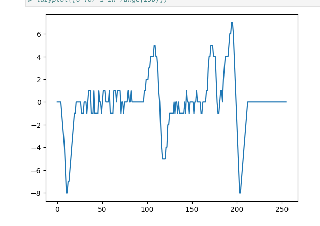
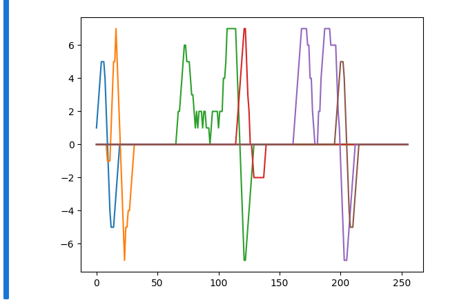

# Log 3

*This one is a bit long and is a work under construction, more than the previous 2.5 logs are. Please read it with some lenience.*

Most of the work I've done since Log2 has been focussed on figuring out a better decoding algorithm. I wanted one that would be agnostic to scan-speed and sample rate, and I think I stumbled onto something nice. I call it Differential Decoding. 

## Differential Decoding
In Log1, I stated that when graphed, the code points appear as stationary points on a graph (differential is ~0). 

In addition to that, if we plot a histogram of the readings around that critical point, we find that the desired bin is a local maximum.

Perform a little bit of smoothing and the pattern becomes a bit more obvious.

This pattern means we can decode by finding local maxima on the smoothed histogram (I'm sure there's a better term for these things. Please forgive my noobiness). But how do we find the local maxima??!! Here's the solution I stumbled on:

1. Construct an array *pat* from the binned data, *h_bin* such that:
   1. pat[i] = 0 if h_bin[i] == h_bin[i-1]
   2. pat[i] = 1 if h_bin[i] > h_bin[i-1]
   3. pat[i] = -1 if h_bin[i] < h_bin[i-1
   
2. For a bin that is a local maximum, the sum of the *pat* values to its left (within some reasonable window) will be to a positive value, while the sum of the sum of the pat values to its right will be a negative value. Crucially, the sum of the left and right sums will be close to 0
   
3. To exploit **2**, construct yet another array pat_sum, such that:
   pat_sum[i] = sum(pat[i-WindowSize//2: i+WindowSize//2])

   Plotted, that would look something like this:

      

4. The gist of things is that you can identify the local maxima by watching for transitions (through~0) from a positive value above some threshold to a negative value beneath some threshold. I think that's pretty nifty.

Well.. we can't have nice things so everything doesn't work out so neatly, as you'll see in the following section.

### COMPLICATION 1: Bin Interference

The x-code we've been working with (call it **[A, C, E]**) is quite friendly in the sense that we never run into a situation where two code points share the same bin. In this case, it is sufficient to determine some maxima, allow the sum to settle back to 0, then use that as a condition to determine the next maxima. However, this is not a property that we can guarantee for r most sequences.  

Consider the x-code sequence **[A, C, E, C]**. How do we tell the second **'C'** from the first **'C'**? The answer is somewhat simple -- whenever we detect a letter/code-point, we 'clear' the space it occupied in the bin-histogram (set the bins where it was active to zero). More specifically, we intermittently bin samples (I call the number of samples binned between checks the decode_cadence) and check the bins for a code-pattern -- as soon as a code pattern is detected, we erase it from the 'frame'(bin-histogram), making sure that the next code-point can be decoded without issue. As long as the decode-cadence is set to some reasonable parameter for the setup, we'll have no problems. I call this process *Intermittent Scanning*

That's all pretty neat, but we can't have nice things -- the process I described above introduces a new complication that I call *Bin Shadowing*.

### COMPLICATION 2: Bin Shadowing
Consider this sequence of values: *[1,1,1,2,2,2,2,2,2,2,3,3,3,3,3,4,4,4]*. While 2 is clearly the mode of the entire sequence, If we consider the first 10 values only (*[1,1,1,2,2,2,2,2,2,2,3]*), the statistical mode is 2; considering the following 10, the mode is 3. A similar problem plagues the incremental Scanning strategy -- if we clear the frame too early, we end up detecting 'shadows' of the actual code-point. Note the multiple zero-crossings close to each other in the diagram below.

   

What to do? What to do? Well, a property of x-codes we defined in an earlier log comes to our rescue! Namely, consecutive x-codes are not allowed to have the same code-point. What that means is that our bin-histogram should be able to hold two consecutive letters in an x-code without any interference happening. Okay... how do we exploit this? We wait until we see two x-code patterns in our bin-histogram, only then do we record the older code-point and clear the space it occupied. Waiting for a second code-point to be detected means that we have a near-perfect guarantee that we are completely past the parts of the sequence where the first pattern occurs -- No bin shadows!!

We can't have nice things so there's yet another complication that pops up -- Bin Conjoinment (I'm on a roll with the naming :)). 

### COMPLICATION 3: Bin Conjoinment
Bin conjoinment is what happens when two code-points appear so close to each other in the bin-histogram that the two patterns interfere with each other at their edges, making them appear like a single code-point.
I'm confident that it's not an insurmountable problem because we'll have two (or three) crucial data points at hand to detect when bin-conjoinment happens:
   1. Bin conjoinments will have a somewhat predictable shape where they happen
   2. We'll know that some older bin we detected has suddenly disappeared or shifted significantly
   3. If the conjoinment happens late in the decode sequence, we'll have historical data of how many samples it takes for a code-point to be detected. 
   

It goes without saying that we'll encounter more complications/pain-points/edge-cases as we go along. Cheers to more logs!!

## NOTE:
1. Binning may be unnecessary for ADCs that report 8-bit values. I might be able to get round it alltogether in my current setup by setting the ESP-32 ADC to 8-bit precision.
2. As you might already suspect, there's a Jupyter Notebook associated with this log. Here's a link to it: [Differential Decoding notebook](../bnw/data/diff_decoding.ipynb)
3. In the actual implementations, I use only two arrays.
4. The decoding algorithm is still O(n). I don't think Differential Decoding adds so much complexity that we'll be unable to decode in real time given a processor with a >= 2 Mhz clock and decent cache (assuming 1 IPC).

## What's On My Mind?
1. Write Differential Decoding in C for the ESP-32.
2. The structure of x-codes. I have a general idea of where that's going but I need to make it more concrete for the project to proceed. This ought to be the subject of the next log
3. I'd like to make the 'aperture' of my makeshift scanner a lot smaller, to explore how that affects decoding. I expect that a smaller 'aperture' will lead to more accurate scans. 
4. I need to print smaller x-code patterns to check how the various decoding algorithms fair in those conditions.
5. Make a comprehensive dataset to run effective tests, and so I can pass it on to my DS friends to have a crack at building a decoding algorithm. 
6. Bluetooth communication.
7. Board design.
8. Global code-space management. 

